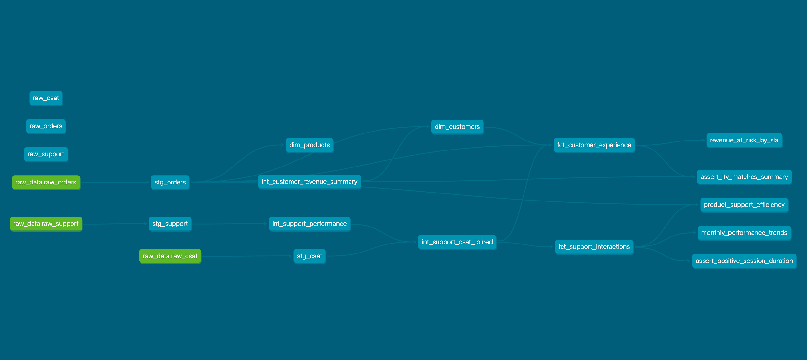

# Customer Experience & Revenue-at-Risk Analytics

## 📌 Project Overview
This project addresses a critical challenge in **Product Operations**: quantifying how operational inefficiencies (like support latency) impact the bottom line. By linking support interaction data with transactional revenue, this pipeline identifies **"Revenue-at-Risk"** and provides actionable insights for **Customer Success** and **Product** teams.

---

## 🏗 System Architecture
The project follows a modern data stack architecture, containerized for reproducibility and scalability.

1.  **Data Generation Layer**: Custom Python scripts using the **Faker** library to simulate realistic eCommerce transactions, support tickets, and CSAT scores.
2.  **Storage Layer**: A **PostgreSQL** OLAP database managed via **Docker Compose**.
3.  **Transformation Layer**: A multi-layered **dbt** project that turns raw logs into analytical star schemas.

---

## 🛠 Tech Stack
* **Data Generation:** Python (Faker Library)
* **Database:** PostgreSQL
* **Transformation:** dbt (Core)
* **Containerization:** Docker & Docker Compose
* **Version Control:** Git & GitHub

---

## 📊 Data Architecture & Modeling
The project follows the modular dbt modeling structure:

1.  **Staging Layer (`stg_`):** Initial cleanup of raw source tables (orders, support, csat). Renaming columns, casting data types, and basic PII masking.
2.  **Intermediate Layer (`int_`):** Complex joins and business logic, such as calculating "Time to Resolve" and "SLA Breaches."
3.  **Mart Layer (`fct_` & `dim_`):** Final, denormalized tables optimized for BI tools.
    * `fct_customer_experience`: The central fact table linking revenue to support sentiment.
    * `dim_customers`: Hashed PII with geographic and demographic attributes.
    * `dim_products`: Product categories, pricing, and unit analysis.

### Directed Acyclic Graph (DAG)
The following lineage graph visualizes the data journey from source to business-ready marts:



---

## 🐍 Data Generation (Python Faker)
To simulate a real-world scenario, a Python script (`generate_data.py`) generates:
* **Orders:** Randomized across countries and categories with variable pricing and units.
* **Support Tickets:** Logic-based generation where certain order delays trigger support chats.
* **CSAT:** Sentiment scores correlated to support wait times and resolution status.

---

## 🚀 Key Business Insights
The pipeline is designed to track three primary Key Performance Indicators (KPIs):

| Metric | Business Definition | Operational Impact |
| :--- | :--- | :--- |
| **SLA Breach Rate** | % of chats exceeding the 3-minute wait threshold. | Highlights staffing gaps or bot inefficiencies. |
| **Revenue-at-Risk** | Total LTV of customers with "Detractor" sentiment and SLA breaches. | Quantifies the financial cost of poor support. |
| **AHT by Category** | Average handle time (AHT) broken down by product reason. | Identifies complex product friction points. |

---

## 🧪 Data Quality & Governance
To ensure "Single Source of Truth" reliability, we utilize a robust testing framework:
*   **Automated Schema Tests**: Unique, Not Null, and Accepted Values for all critical columns.
*   **Custom Singular Tests**: SQL-based validation to ensure business rules are met, such as verifying that session durations are never negative.
*   **Documentation**: Built-in dbt documentation for every model and column to enable self-service analytics.

---

---

## ⚙️ Getting Started

### Prerequisites
*   Docker & Docker Compose installed.
*   Git installed.

### Setup
1.  **Clone the Repo**:
    ```bash
    git clone [https://github.com/your-username/your-repo-name.git](https://github.com/your-username/your-repo-name.git)
    cd your-repo-name
    ```
2.  **Spin up the Environment**:
    ```bash
    docker compose up -d
    ```
3.  **Run the dbt Pipeline**:
    ```bash
    docker compose run --rm dbt build
    ```
4.  **View Interactive Documentation**:
    ```bash
    docker compose run --rm -p 8080:8080 dbt docs serve --host 0.0.0.0
    ```
    *Access at `http://localhost:8080`*
